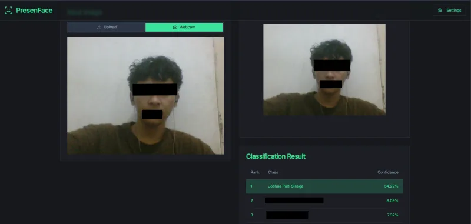

<div align="center">

# PresenFace: Face Recognition Image Classification System



A comprehensive end-to-end face recognition system powered by deep learning, featuring real-time webcam classification, drag-and-drop image upload, and seamless cloud deployment.

[](https://nextjs.org/)
[](https://www.python.org/)
[](https://pytorch.org/)
[](https://huggingface.co/)
[](https://vercel.com/)

</div>

---

## Table of Contents

-   [Project Overview](#project-overview)
-   [AI Pipeline System](#ai-pipeline-system)
-   [Backend Deployment to Hugging Face](#backend-deployment-to-hugging-face)
-   [Frontend Deployment to Vercel](#frontend-deployment-to-vercel)
-   [Local Development](#local-development)
-   [Team](#team)

---

## Project Overview

PresenFace is a production-ready face recognition system combining a fine-tuned InceptionResnetV1 model with a Next.js web interface. It supports real-time webcam capture and file uploads, utilizing InsightFace for robust face detection and alignment.

### Key Features

-   Real-time webcam recognition with continuous classification
-   Drag-and-drop image upload interface
-   Top-5 predictions with confidence scores
-   Runtime server URL configuration
-   Advanced face alignment using InsightFace landmarks

---

## AI Pipeline System

### Model Architecture

-   **Base Model**: InceptionResnetV1 (FaceNet) pretrained on VGGFace2
-   **Input**: 224x224 RGB images
-   **Output**: Softmax probability distribution across face classes
-   **Regularization**: Dropout (0.5) + Weight Decay (5e-4)

### Data Processing Pipeline

```
Raw Image → Face Detection → Landmark Detection → Face Alignment → Normalization → Inference
```

**Face Detection & Alignment:**

-   InsightFace (Buffalo_L model) for face detection
-   Custom similarity transformation for face alignment
-   Standardized 224x224 face crops

**Training Configuration:**

```python
batch_size: 16
epochs: 40
learning_rate: 1e-4
optimizer: AdamW
loss: Cross-Entropy
```

---

## Backend Deployment to Hugging Face

### API Endpoint

**URL**: `https://afenmarbun-backend-deep-learning.hf.space/predict`

**Request:**

```http
POST /predict
Content-Type: multipart/form-data
Body: file (image)
```

**Response:**

```json
{
    "predictions": [
        {
            "rank": 1,
            "class": "Person Name",
            "confidence": 0.9523,
            "confidence_percent": "95.23%"
        }
    ]
}
```

### Deployment Steps

1. **Create Hugging Face Space**

    - Go to [Hugging Face Spaces](https://huggingface.co/spaces)
    - Create new Space with Docker or Gradio SDK
    - Choose CPU Basic hardware

2. **Upload Files**

    ```bash
    git clone https://huggingface.co/spaces/USERNAME/SPACE_NAME
    cd SPACE_NAME

    # Copy files
    copy ..\backend\app.py .
    copy ..\backend\best_model.pth .
    copy ..\backend\class_names.json .
    copy ..\backend\requirements.txt .

    # Push to deploy
    git add .
    git commit -m "Deploy backend"
    git push
    ```

3. **Wait for Build**
    - Monitor build logs in Space interface
    - Test endpoint when status shows "Running"

---

## Frontend Deployment to Vercel

### Deployment Steps

#### Option 1: Deploy via Vercel CLI

```bash
# Install Vercel CLI
npm install -g vercel

# Login
vercel login

# Deploy
cd frontend
vercel --prod
```

#### Option 2: Deploy via GitHub (Recommended)

1. **Push to GitHub**

    ```bash
    git init
    git add .
    git commit -m "Initial commit"
    git push -u origin main
    ```

2. **Connect to Vercel**

    - Go to [Vercel Dashboard](https://vercel.com/dashboard)
    - Click "New Project"
    - Import your GitHub repository
    - Configure:
        - Framework: Next.js
        - Root Directory: `frontend`
    - Add environment variable:
        - `NEXT_PUBLIC_DEFAULT_SERVER_URL`: Your Hugging Face Space URL
    - Click "Deploy"

3. **Auto Deployment**
    - Vercel automatically deploys on every push to main branch
    - Preview deployments for pull requests

---

## Local Development

### Backend Setup

```bash
cd backend
python -m venv venv
venv\Scripts\activate          # Windows
pip install -r requirements.txt
python app.py                   # Runs on http://localhost:5000
```

### Frontend Setup

```bash
cd frontend
npm install
npm run dev                     # Runs on http://localhost:9002
```

### Full Stack Testing

1. Start backend (Terminal 1): `python app.py`
2. Start frontend (Terminal 2): `npm run dev`
3. Open browser: `http://localhost:9002`
4. Configure server URL to `http://localhost:5000/predict`

---

## Team

**PresenFace Development Team**

This project was developed as part of the Deep Learning course assignment.

| Name                    | Student ID | Role                             |
| ----------------------- | ---------- | -------------------------------- |
| Joshua Palti Sinaga     | 122140141  | AI Pipeline & Model Training     |
| Alfajar                 | 122140122  | Backend Development & Deployment |
| Rustian Afencius Marbun | 122140155  | Frontend Development & UI/UX     |

---

<div align="center">

**PresenFace** - Deep Learning Face Recognition System

Built with dedication to AI and modern web development

[Report Issue](https://github.com/jo0707/deep-learning-frontend/issues) · [View Demo](https://afenmarbun-backend-deep-learning.hf.space)

</div>
